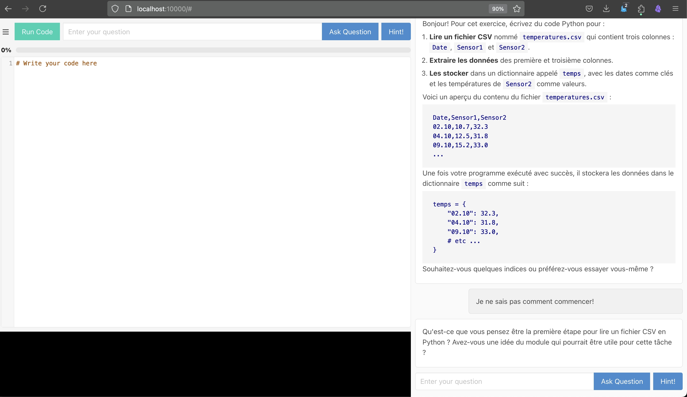

# Steacher

We've all seen our students copy-pasting code into chatGPT to get direct answers. But it's a terrible way to learn with AI.

Here's an idea: **have the AI guide the student by asking questions and providing feedback, never by writing the code for them.** À la [Socratic method](https://en.wikipedia.org/wiki/Socratic_method). See also Khan Academy's [Khanmigo](https://docsbot.ai/prompts/education/khanmigo-lite-socratic-tutor).


## Features

- **Interactive Code Editor**: Write and execute Python code directly in the browser.
- **Real-time Feedback**: Get instant feedback on your code with suggestions for improvement.
- **Socratic Guidance**: Receive guidance through questions that help you think critically about your solutions.
- **Progress Tracking**: Monitor your progress with a visual progress bar.



## Installation

   ```bash
   # install dependencies
   pip install -r requirements.txt

   # set up openai api key
   export OPENAI_API_KEY=your_openai_api_key_here

   # run the application
   python app.py
   ```
Point your web browser to `http://localhost:10000` 

## Contact

For any questions or feedback, please contact us at [renaud.richardet@hevs.ch](mailto:renaud.richardet@hevs.ch)